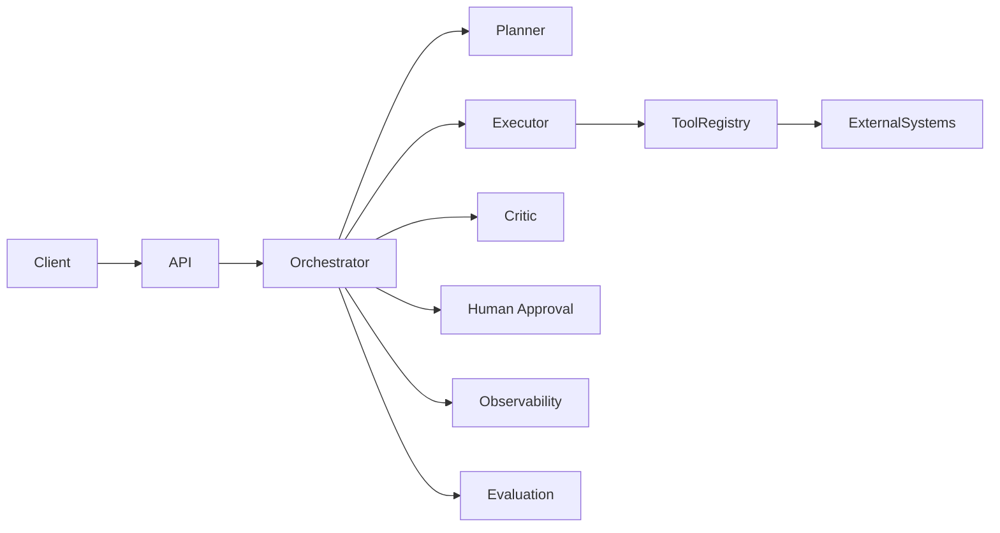

# Agentic Orchestration Platform

Reference architecture for **production-oriented multi-agent orchestration**: planner/executor patterns, tool calling, deterministic workflows, human-in-the-loop gates, evaluation hooks, and observability.

> Architecture kit — not a hosted SaaS. Designed to demonstrate how enterprise agent systems should be structured.

## Architecture Focus

- Multi-agent roles (planner, executor, critic)
- Explicit orchestration graph with retry/fallback policies
- Tool registry with typed contracts
- Human-in-the-loop approval checkpoints
- Run tracing, metrics, and evaluation seams
- Deterministic workflow mode for regulated paths

## High-Level Architecture



## Key Capabilities

| Capability | Description |
|---|---|
| Orchestrator | Coordinates agent turns, budgets, and termination criteria |
| Tool registry | Registers tools with schemas, timeouts, and allow-lists |
| Workflows | Declarative DAG steps with gating and compensation |
| HITL | Pause/resume with approval payloads |
| Observability | Structured run events and span-friendly trace IDs |
| Evaluation | Offline scoring hooks for trajectory quality |

## Technology Stack

- Python 3.11+
- FastAPI (control plane API)
- Pydantic models for contracts
- pytest

## Project Layout

```
src/
  orchestration/   # run loop, budgets, policies
  agents/          # agent role implementations
  tools/           # tool interfaces + registry
  workflows/       # deterministic workflow engine
  observability/   # tracing + metrics events
tests/
docs/
```

## Setup

```bash
python -m venv .venv
source .venv/bin/activate  # Windows: .venv\Scripts\activate
pip install -r requirements.txt
cp .env.example .env
pytest
uvicorn src.api:app --reload
```

## Example Usage

```python
from src.orchestration.runner import Orchestrator
from src.agents.roles import PlannerAgent, ExecutorAgent, CriticAgent

orch = Orchestrator(agents=[PlannerAgent(), ExecutorAgent(), CriticAgent()])
result = orch.run("Summarize vendor risk for ACME and propose mitigations")
print(result.final_output)
print(result.trace_id)
```

## Security Considerations

- Tools must be allow-listed per workflow
- Secrets via environment variables only (never commit .env)
- HITL required for irreversible side effects
- Prompt/tool outputs treated as untrusted input

## Known Limitations

- LLM providers are pluggable stubs in this reference kit
- Persistence and multi-tenant auth are intentionally thin
- Not a drop-in replacement for commercial agent platforms

## License

MIT

